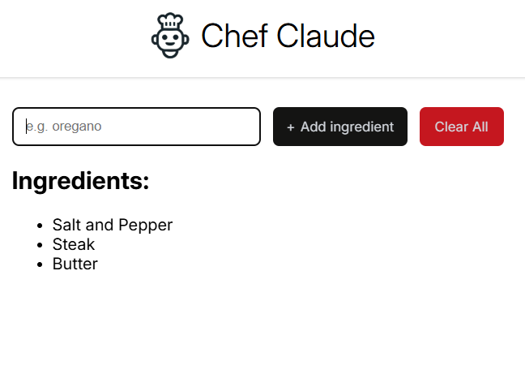
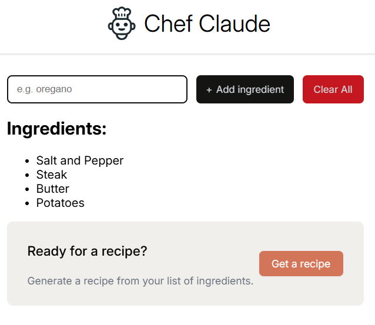
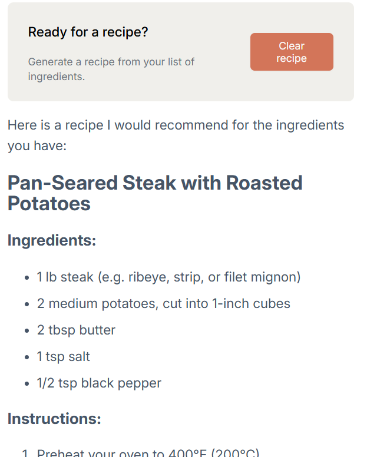

# AI Recipe Generator

**My First React Project!**

A simple and useful project where you input the ingredients you have on hand, and AI will generate a custom recipe. Built with **React.js**, **JavaScript**, **Claude API**, **HTML**, and **CSS**.

---

**Functionality**

Input ingredients into the main form, and add them to the list by pressing the '+ Add Ingredient" button. You can always start your list over by clicking "Clear Ingredients".
 
 

 You must add at least four ingredients before you can generate a recipe. When you have enough, a section will appear asking you if you're ready to get a recipe. When you are, click "Get Recipe".

 

 After a second or two, the recipe should be rendered below! If you don't like the recipe, feel free to clear the recipe with the "Clear Recipe" button and generate a new one. You can always add more ingredients, or start over by using "Clear Ingredients"

 

**To Run**
Unfortunatly not hosted yet (I need to set up some server logic to handle the API keys), but If you're curious you're welcome to clone the repo, install dependencies, and npm run dev!

---

## Tech Stack

- **Frontend**: React.js, JavaScript, HTML, CSS
- **AI Integration**: Claude API (Anthropic)

